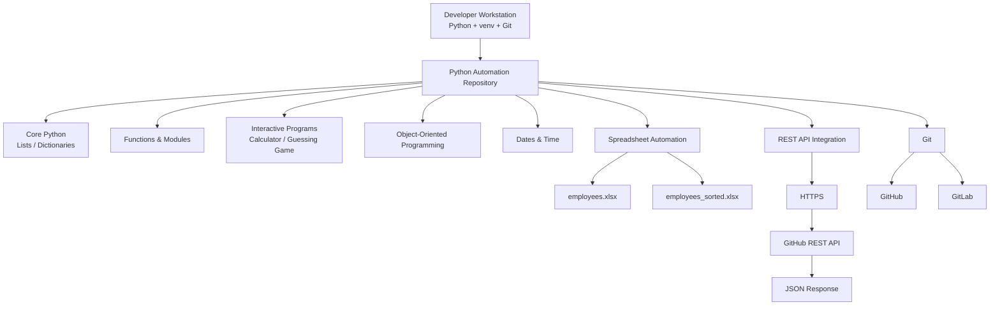

# Python Programming & Automation Lab

A practical Python engineering project covering core programming constructs, modular design, object-oriented programming, spreadsheet automation, date processing, input validation, and REST API integration.

The repository applies software-engineering and DevOps practices to foundational Python exercises, including isolated dependencies, structured Git workflows, feature branches, non-fast-forward merges, validation, secure handling of external services, and mirrored GitHub/GitLab repository history.

## Overview

This project contains ten progressively more advanced Python exercises:

| Exercise | Focus                                                     |
| -------- | --------------------------------------------------------- |
| 01       | Lists, filtering, loops, and user input                   |
| 02       | Dictionaries, mutation, merging, aggregation              |
| 03       | Nested dictionaries and iteration                         |
| 04       | Functions and custom helper modules                       |
| 05       | Interactive calculator with validation and error handling |
| 06       | Random module and while-loop guessing game                |
| 07       | Classes, objects, methods, and inheritance                |
| 08       | Date and time calculations                                |
| 09       | Spreadsheet processing with `openpyxl`                    |
| 10       | GitHub REST API integration with `requests`               |

## Architecture



## Repository Structure

```text
.
├── .gitignore
├── README.md
├── requirements.txt
├── docs/
│   └── screenshots/
└── exercises/
    ├── exercise-01-lists/
    ├── exercise-02-dictionaries/
    ├── exercise-03-list-of-dictionaries/
    ├── exercise-04-functions/
    ├── exercise-05-calculator/
    ├── exercise-06-guessing-game/
    ├── exercise-07-oop/
    ├── exercise-08-dates/
    ├── exercise-09-spreadsheets/
    └── exercise-10-rest-api/
```

## Technologies

* Python 3
* Git
* GitHub
* GitLab
* `openpyxl`
* `requests`
* GitHub REST API
* Microsoft Excel/Open XML (`.xlsx`)
* Python standard-library modules including `datetime` and `random`

## Local Setup

Clone the repository:

```bash
git clone git@github.com:younghadiz/python-devops-automation-lab.git
cd python-devops-automation-lab
```

Create an isolated environment:

```bash
python3 -m venv .venv
source .venv/bin/activate
```

Install dependencies:

```bash
python -m pip install --upgrade pip
python -m pip install -r requirements.txt
```

Verify:

```bash
python --version
python -m pip list
```

## Running the Exercises

### Lists

```bash
python exercises/exercise-01-lists/main.py
```

### Dictionaries

```bash
python exercises/exercise-02-dictionaries/main.py
```

### List of Dictionaries

```bash
python exercises/exercise-03-list-of-dictionaries/main.py
```

### Functions and Modules

```bash
cd exercises/exercise-04-functions
python main.py
cd ../..
```

### Calculator

```bash
python exercises/exercise-05-calculator/main.py
```

### Guessing Game

```bash
python exercises/exercise-06-guessing-game/main.py
```

### Classes and Inheritance

```bash
cd exercises/exercise-07-oop
python main.py
cd ../..
```

### Birthday Countdown

```bash
python exercises/exercise-08-dates/main.py
```

### Spreadsheet Automation

Place the supplied training workbook at:

```text
exercises/exercise-09-spreadsheets/data/employees.xlsx
```

Then run:

```bash
python exercises/exercise-09-spreadsheets/main.py
```

The program generates:

```text
exercises/exercise-09-spreadsheets/employees_sorted.xlsx
```

The generated spreadsheet contains:

```text
name
years of experience
```

and is sorted by years of experience in descending order.

### GitHub REST API

```bash
python exercises/exercise-10-rest-api/main.py
```

Enter a GitHub username when prompted.

The script calls the GitHub public-repositories endpoint and outputs each repository's name and URL.

## Engineering Practices

The project intentionally applies engineering practices beyond the minimum exercise requirements.

### Isolated Dependencies

Third-party packages are installed into a Python virtual environment instead of system Python.

### Dependency Pinning

Runtime dependencies are declared in `requirements.txt` for reproducible environments.

### Modular Code

Reusable functions and classes are separated into modules rather than placing all logic into a single file.

### Input Validation

Interactive programs validate user input and provide actionable feedback instead of terminating unexpectedly.

### Network Error Handling

The REST API exercise handles timeouts, connection failures, HTTP errors, and empty results.

### API Timeouts

External HTTP requests use an explicit timeout so the program cannot block indefinitely while waiting for a remote service.

### Source vs Generated Artifacts

The spreadsheet source file is treated as input data. The generated sorted workbook is ignored by Git because it can be reproduced by executing the program.

## Security

No credentials are required for the GitHub exercise because it only reads publicly available repositories.

Secrets must never be committed to this repository, including:

* API tokens
* personal access tokens
* passwords
* SSH private keys
* cloud credentials
* `.env` files
* production employee data

If authentication is added in the future, credentials should be injected through environment variables or a dedicated secret-management system.

## Git Workflow

Development follows:

```text
main
  └── develop
       ├── feature/exercise-01-lists
       ├── feature/exercise-02-dictionaries
       ├── feature/exercise-03-list-of-dictionaries
       ├── feature/exercise-04-functions
       ├── feature/exercise-05-calculator
       ├── feature/exercise-06-guessing-game
       ├── feature/exercise-07-oop
       ├── feature/exercise-08-dates
       ├── feature/exercise-09-spreadsheets
       ├── feature/exercise-10-rest-api
       └── feature/documentation
```

Feature branches are merged using non-fast-forward merges:

```bash
git merge --no-ff feature/<name>
```

This preserves explicit feature boundaries in repository history.

Inspect the history with:

```bash
git log --graph --decorate --oneline --all
```

## Validation

Compile all Python source files:

```bash
python -m compileall exercises
```

Check repository state:

```bash
git status
```

Review dependency state:

```bash
python -m pip list
```

Run the individual scripts from the commands documented above.

## Key Engineering Outcomes

This project demonstrates practical understanding of:

* Python data structures
* loops and conditionals
* type conversion
* defensive input validation
* exception handling
* functions and module boundaries
* object-oriented programming
* inheritance
* reusable class design
* date/time processing
* file and spreadsheet automation
* REST APIs
* HTTP request/response workflows
* JSON processing
* external package management
* reproducible Python environments
* Git feature branching
* multi-remote source control

## Optional Cloud Validation

The applications do not require a cloud server. They can optionally be cloned to a hardened Linux VM to verify portability across environments.

A cloud deployment should use:

* SSH key authentication
* non-root administrative user
* least-exposed firewall rules
* patched operating system
* isolated Python virtual environment
* no credentials stored in Git

## Future Improvements

Potential extensions include:

* automated unit tests with `pytest`
* static analysis and linting
* GitHub Actions and GitLab CI pipelines
* dependency vulnerability scanning
* REST API pagination
* authenticated GitHub API support via environment variables
* structured application logging
* Python packaging with `pyproject.toml`
* Dockerized execution environments

## Purpose

This repository is intentionally structured as an engineering portfolio project rather than a collection of disconnected Python snippets. It demonstrates both Python fundamentals and the development practices required to build maintainable automation tooling.
